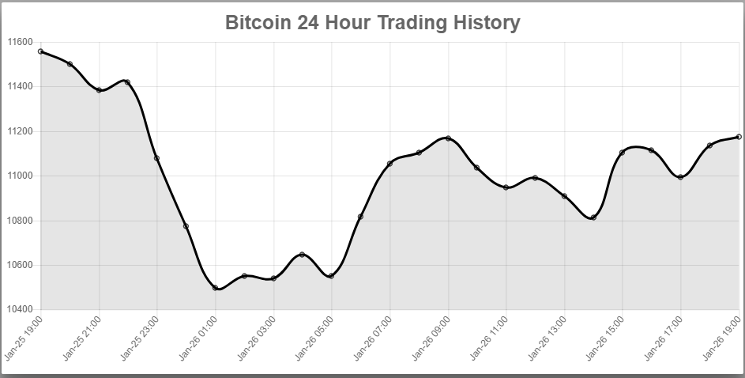

# CryptoTracker.pro - Client

An app for learning about and tracking crypto-currencies.

## Header 2

More about the app...

Background:
----------------------------------------------------
We wanted to develop an app to let people learn about crypto-currencies, and crypto trading.  In addition, they can track specific crypto-currencies they are interested in.

Technology:
----------------------------------------------------
On the client side, I use React with the Material-ui design library.  I use the react-chartjs-2 library for the chart.

Material-ui: https://material-ui.com/

Screenshot for Daily Prioritizer:
--------------------------------

